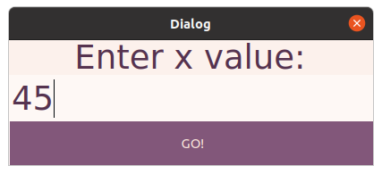
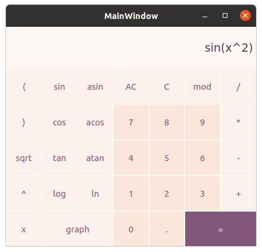
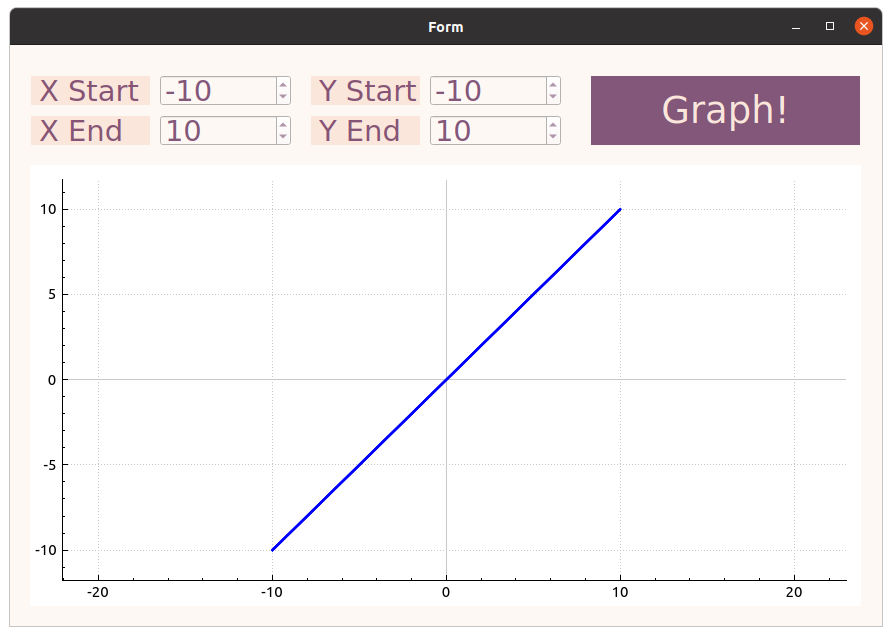

# SmartCalc v1.0

## Implementation of SmartCalc v1.0

- GUI based on Qt.
- Both integers and real numbers with a dot can be input into the program.
- The calculation will be done after you complete entering the calculating expression and press the `=` symbol.
- Plotting a graph of a function given by an expression in infix notation with the variable _x_
- Bracketed arithmetic expressions in infix notation support the following arithmetic operations and mathematical functions:

  - **Arithmetic operators**:

    | Operator name  | Infix notation   (Classic) |
    | -------------- | ------------------------------- |
    | Brackets       | (a + b)                         |
    | Addition       | a + b                           |
    | Subtraction    | a - b                           |
    | Multiplication | a \* b                          |
    | Division       | a / b                           |
    | Power          | a ^ b                           |
    | Modulus        | a mod b                         |
    | Unary plus     | +a                              |
    | Unary minus    | -a                              |

  - **Functions**:

    | Function description       | Function |
    | -------------------------- | -------- |
    | Computes cosine            | cos(x)   |
    | Computes sine              | sin(x)   |
    | Computes tangent           | tan(x)   |
    | Computes arc cosine        | acos(x)  |
    | Computes arc sine          | asin(x)  |
    | Computes arc tangent       | atan(x)  |
    | Computes square root       | sqrt(x)  |
    | Computes natural logarithm | ln(x)    |
    | Computes common logarithm  | log(x)   |

- The program is developed in C language of C11 standard using gcc compiler.
- The program is built with Makefile which contains standard set of targets for GNU-programs: all, install, uninstall, clean, dvi, dist, tests, gcov_report.
- The program is developed according to the principles of structured programming

